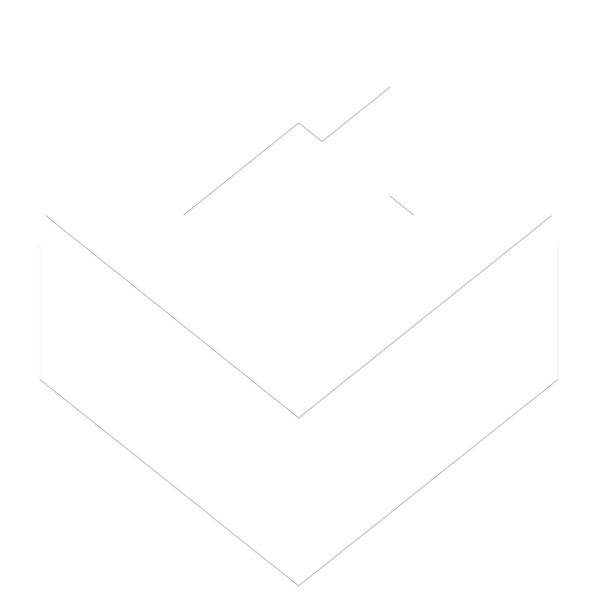
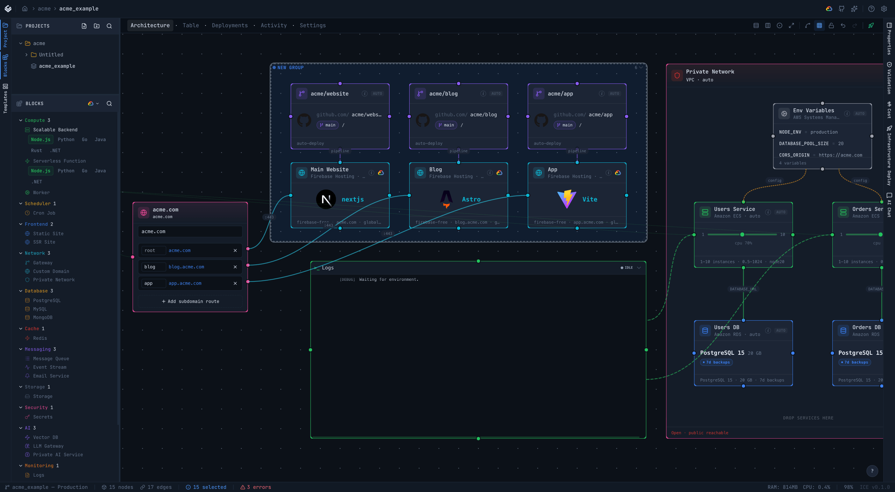
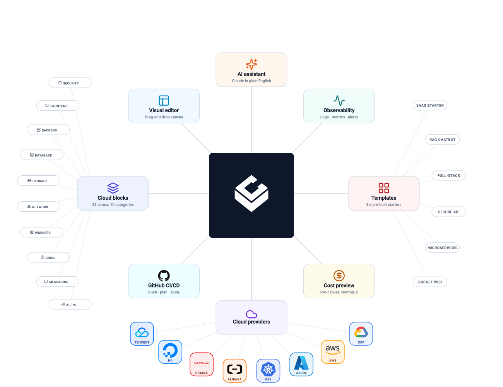

<h1 align="center">
  
  &nbsp;Integrated Cloud Environment
</h1>

<p align="center">Visual Studio for Cloud</p>

<p align="center">
  <a href="https://github.com/light-cloud-com/ice/actions/workflows/ci.yml"></a>
  <a href="https://github.com/light-cloud-com/ice/releases/latest"></a>
  <a href="LICENSE"></a>
  <a href="https://nodejs.org">= 22" /></a>
  <a href="package.json"></a>
</p>

<p align="center">
  
</p>

<p align="center">
  
  
</p>

## Getting Started

```bash
# Node 22+, pnpm 10+
git clone https://github.com/light-cloud-com/ice.git && cd ice
pnpm install
pnpm schemas:build      # one-time, ~10-15 min, cached after
pnpm dev:all            # then open http://localhost:5173
pnpm dev:desktop        # or desktop app
```

Full guide: [docs/getting-started.md](docs/getting-started.md).

## Providers at a glance

- 🟢 **Google Cloud - stable(ish).** 20 service handlers, 45+ importers, full create / update / destroy.
- 🟡 **AWS - in progress.**
- 🟡 **Azure - in progress.**
- ⚪ **IBM Cloud - planned.**
- ⚪ **Kubernetes - planned.**
- ⚪ **Alibaba Cloud - planned.**
- ⚪ **Oracle Cloud - planned.**
- ⚪ **DigitalOcean - planned.**
- ⚪ **Tencent Cloud - planned.**

- 🟢 **GitHub - integration.**

## Docs

- 📚 [Docs landing](docs/README.md) - audience-grouped index; start here if you're not sure where to look.
- 🚀 [Getting Started](docs/getting-started.md) - install, generate schemas (`ice-schemas.db`), first run, first deploy.
- 🏗 [Architecture](docs/architecture/README.md) - how the pieces fit. Deep-dive pages: [core engine](docs/architecture/core-engine.md), [frontend](docs/architecture/frontend.md), [services](docs/architecture/services.md), [database](docs/architecture/database.md), [desktop](docs/architecture/desktop.md), [AI assistant](docs/architecture/ai-assistant.md).
- 🔌 [Extending providers](docs/reference/extending-providers.md) - add a new cloud.
- 🧱 [Blocks](docs/reference/blocks.md) - concept palette + per-provider variants.
- 🧪 [Testing](docs/testing.md) - unit, integration, GCP scenario dashboard.
- 📖 [Glossary](docs/glossary.md) - block, blueprint, handler, importer, plan, apply.
- 🗺 [Roadmap](ROADMAP.md) - what's shipped, in progress, planned.

## Help

- 🐞 **Bug or feature** - [open an issue](https://github.com/light-cloud-com/ice/issues/new/choose).
- 💬 **Question** - [GitHub Discussions](https://github.com/light-cloud-com/ice/discussions).
- 🔐 **Security** - [SECURITY.md](SECURITY.md); please don't open a public issue.
- 🤝 **Contributing** - [CONTRIBUTING.md](CONTRIBUTING.md).
- 📜 **License** - [Apache 2.0](LICENSE) · [NOTICE](NOTICE).
