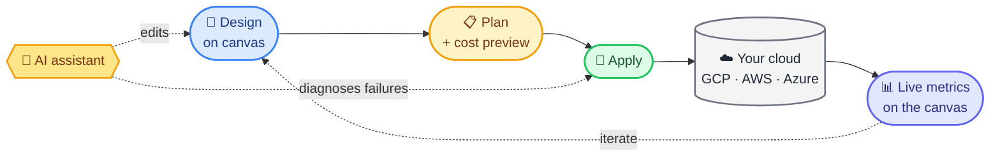

<h1 align="center">
  
  &nbsp;Integrated Cloud Environment
</h1>

<p align="center"><strong>A <a href="https://light-cloud.com">Light Cloud</a> project · Figma for cloud infrastructure, with a deploy button.</strong></p>

<p align="center">
  <a href="https://github.com/light-cloud-com/ice/actions/workflows/ci.yml"></a>
  <a href="https://github.com/light-cloud-com/ice/releases/latest"></a>
  <a href="LICENSE"></a>
  <a href="https://nodejs.org">= 22" /></a>
  <a href="package.json"></a>
</p>

<p align="center">
  <a href="docs/provider-status.md"></a>
</p>

<p align="center">
  
</p>

## The loop



## Getting Started

```bash
# Node 22+, pnpm 10+
git clone https://github.com/light-cloud-com/ice.git && cd ice
pnpm install
pnpm schemas:build      # one-time, ~10-15 min, cached after
pnpm dev:all            # then open http://localhost:5173
```

Full guide: [docs/getting-started.md](docs/getting-started.md).

## Main features

<p align="center">
  
</p>

## Providers at a glance

| Provider | Readiness | Details |
|---|---|---|
| 🟢 **Google Cloud** | **stable** | 20 service handlers, 45+ importers, full create / update / destroy |
| 🟡 **AWS** | experimental | Major primitives deploy; parity with GCP in progress |
| 🟡 **Azure** | experimental | Major primitives deploy; parity with GCP in progress |
| ⚪ Kubernetes, Alibaba, Oracle, DigitalOcean, Tencent | design-only | Blocks render; deployers next |
| 🟢 **GitHub** | integration | PAT or device flow - drives the pipeline triggers |

Source of truth: [docs/provider-status.md](docs/provider-status.md) (mirrors `PROVIDER_READINESS` in [`packages/constants/src/providers.ts`](packages/constants/src/providers.ts)).

## Docs

|   |   |
|---|---|
| 🚀 [Getting Started](docs/getting-started.md) | Install, first run, troubleshooting |
| 🏗 [Architecture](docs/architecture.md) | How the pieces fit |
| ☁️ [Deploying to GCP](docs/deploying-to-gcp.md) | End-to-end tutorial · [AWS](docs/deploying-to-aws.md) · [Azure](docs/deploying-to-azure.md) |
| 📊 [Provider status](docs/provider-status.md) | Per-provider readiness matrix |
| 🤖 [AI assistant](docs/ai-assistant.md) | Claude integration, OpenAI-compat backends |
| 🔌 [Extending providers](docs/extending-providers.md) | Add a new cloud |
| 🧪 [Testing](docs/testing.md) | Unit · integration · GCP scenario dashboard |
| 🆘 [Troubleshooting](docs/troubleshooting.md) | Common issues |
| 📖 [Glossary](docs/glossary.md) | Block, blueprint, handler, importer, … |
| 🗺 [Roadmap](ROADMAP.md) | What's shipped, in progress, planned |

## Help

| | |
|---|---|
| 🐞 Bug or feature | [Open an issue](https://github.com/light-cloud-com/ice/issues/new/choose) |
| 💬 Question | [GitHub Discussions](https://github.com/light-cloud-com/ice/discussions) |
| 🔐 Security | [SECURITY.md](SECURITY.md) - please don't open a public issue |
| 🤝 Contributing | [CONTRIBUTING.md](CONTRIBUTING.md) |
| 📜 License | [Apache 2.0](LICENSE) · [NOTICE](NOTICE) |
