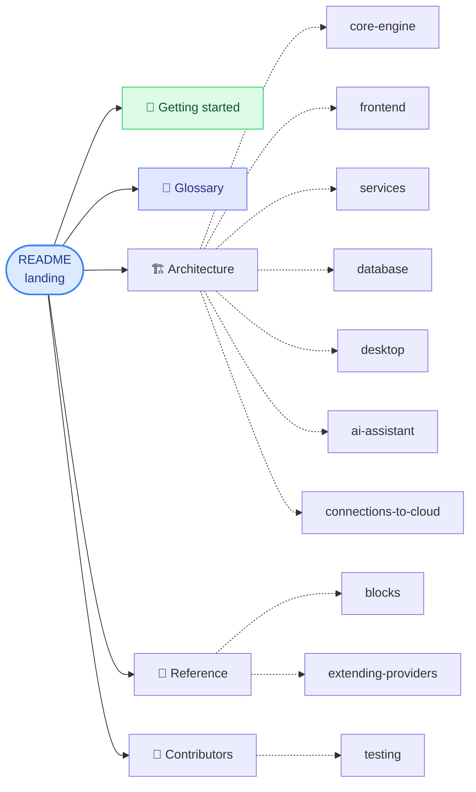

# ICE Documentation

Long-form docs for ICE. For the 30-second pitch and install instructions, start at the [repo root README](../README.md).

## Map

## For users

You want to install ICE, build a canvas, and deploy something.

| Page                                  | What it covers                                                            |
| ------------------------------------- | ------------------------------------------------------------------------- |
| [Getting started](getting-started.md) | Install, generate schemas, first run, first deploy, common install issues |
| [Glossary](glossary.md)               | Block, blueprint, handler, importer, plan, apply, …                       |

Per-provider readiness lives in code: [`PROVIDER_READINESS`](../packages/constants/src/providers.ts).

## For operators

You want to run ICE for a team (self-hosted).

| Page                                            | What it covers                                                                                              |
| ----------------------------------------------- | ----------------------------------------------------------------------------------------------------------- |
| [Architecture overview](architecture/README.md) | Bird's-eye view of how the system fits                                                                      |
| [Database](architecture/database.md)            | The two SQLite DBs (`ice-schemas.db` catalog + `.desktop-dev.db` runtime), Prisma schema, Postgres for prod |
| [Desktop](architecture/desktop.md)              | Electron wrapper, embedded gateway, packaging, code-signing status                                          |
| [AI assistant](architecture/ai-assistant.md)    | Anthropic key, OpenAI-compat backends, cost, rate limits                                                    |

## For contributors

You want to read the code, fix bugs, or add features. The canonical contributor doc is [`../CONTRIBUTING.md`](../CONTRIBUTING.md) — pages below complement it.

| Page                                                                        | What it covers                                              |
| --------------------------------------------------------------------------- | ----------------------------------------------------------- |
| [Testing](testing.md)                                                       | Unit · integration · E2E · GCP scenario dashboard           |
| [Architecture → core engine](architecture/core-engine.md)                   | Graph, schemas, plan/apply, scheduler, importers            |
| [Architecture → frontend](architecture/frontend.md)                         | React, Redux slices, SVG canvas, feature folders            |
| [Architecture → services](architecture/services.md)                         | The six backend services composed by the gateway            |
| [Architecture → connections to cloud](architecture/connections-to-cloud.md) | How a canvas edge becomes env vars, IAM, and network policy |
| [Reference → blocks](reference/blocks.md)                                   | Concept palette + per-provider variants                     |
| [Reference → extending providers](reference/extending-providers.md)         | How to add a new cloud provider                             |

## How these docs are maintained

These pages are hand-written and versioned with the code. When docs and code disagree, **code wins** — open an issue or PR to fix the docs. There is no auto-generated or LLM-generated content under `docs/` (a deliberate choice after a brief Obsidian-plugin experiment).

When in doubt about where a new doc belongs:

- A new subsystem write-up → `architecture/`.
- A lookup table or list of named things → `reference/`.
- A contributor how-to → flat at `docs/` root.

## See also

- [ROADMAP.md](../ROADMAP.md) — what's shipped, in progress, and planned.
- [CONTRIBUTING.md](../CONTRIBUTING.md) — contributor workflow + what we will/won't merge.
- [SECURITY.md](../SECURITY.md) — how to report vulnerabilities.
- [SUPPORT.md](../SUPPORT.md) — where to get help.
