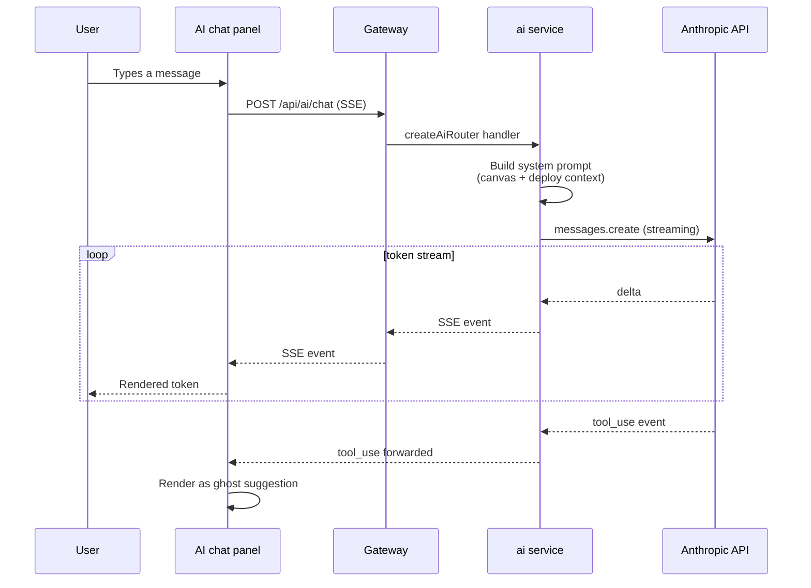

# AI Assistant

ICE ships with an optional AI assistant powered by Anthropic's Claude. It can answer questions about the current canvas, propose changes (edits, additions, deletions), and diagnose failed deploys.

## Enabling

The assistant is off by default. To turn it on, set `ANTHROPIC_API_KEY` in your environment before launching ICE:

```bash
# Local dev
echo 'ANTHROPIC_API_KEY=sk-ant-...' >> .env
pnpm dev:all

# Desktop - set the env var before launching the app (macOS / Linux):
ANTHROPIC_API_KEY=sk-ant-... open -a "ICE.app"
```

Get a key at [console.anthropic.com/settings/keys](https://console.anthropic.com/settings/keys).

**Without a key:** the chat panel shows a one-line "AI is not configured" prompt. No error, no crash - every other ICE feature works unchanged.

**Invalid key:** the first chat send returns a 401 from Anthropic; the UI surfaces an error.

> An in-app **Settings → AI** flow that stores the key encrypted in the workspace DB (matching the cloud-provider flow) is on the roadmap - see [ROADMAP.md](../ROADMAP.md). Until that lands, the env var is the supported path.

## What a typical turn costs

A median turn (1 user message, ~30-block canvas as context, ~150-token reply) lands around:

- Input: ~4–8k tokens (canvas serialization dominates).
- Output: ~200–500 tokens.

At Claude Sonnet 4.x rates that's a fraction of a cent per turn. Deploy-diagnosis turns are larger (the failure payload + relevant graph context) - typically 8–15k input tokens. Per-org token tracking is part of ICE Cloud; in Community Edition you watch your usage on the Anthropic console directly.

Rate limiting on the SSE endpoint matches the gateway-wide policy (1000 req/min in dev/test, 200/min in production).

## What it does today

- **Chat.** Ask questions about the canvas. The model receives the current graph as context. Answers stream over Server-Sent Events.
- **Proposals via ghost mode.** When the model wants to modify the canvas, it emits tool-use events that the client applies as "ghost" suggestions (visible but uncommitted). The user accepts or rejects.
- **Deploy diagnosis.** On a deploy failure, the user can click "Explain" and the `diagnose-deploy` service forwards the error payload + relevant graph context to Claude for a plain-English explanation and a suggested fix.
- **Read-level context injection.** A summary of the current deployment state (what's deployed where, what's drifted, what's pending) is injected into the system prompt so the model's answers stay grounded in reality.

## What it doesn't do (yet)

- **Live cloud queries.** The model doesn't hit GCP/AWS APIs directly. It sees what ICE's importer last saw - not the current live state. Live read capabilities are on the [roadmap](../ROADMAP.md).
- **Autonomous apply.** No "let the model deploy on its own" mode. Every change from a model proposal goes through the user's explicit approval.
- **Tool-use loops.** No multi-step chain-of-tool calls today. Each turn is one prompt, one response, one optional canvas mutation.

## How it's wired



Key files:

- `services/ai/src/routes/ai.ts` - the SSE endpoint.
- `services/ai/src/services/ai.service.ts` - prompt building + streaming.
- `services/ai/src/services/diagnose-deploy.service.ts` - error-diagnosis service.
- `packages/ai/` - the provider abstraction (Anthropic + OpenAI-compatible).
- `packages/ui/src/features/ai/` - the chat panel, SSE client, ghost-mode UI.
- `packages/ui/src/store/slices/ai-slice.ts` - chat history, streaming state.
- `packages/ui/src/store/slices/ghost-slice.ts` - proposed (uncommitted) canvas mutations.

## Prompt construction

The system prompt is built per request in `ai.service.ts` from three parts:

1. **A project-agnostic preamble** - who Claude is in this context, how to format tool-use events, canvas conventions.
2. **Canvas context** - a serialized summary of the current canvas: blocks, edges, provider, environment, validation state.
3. **Deployment context** - latest per-environment status: what's deployed, failed, drifted, pending. Added by the "AI Read L1" work on the [roadmap](../ROADMAP.md).

The user message follows as a standard user turn. For multi-turn conversations, previous turns are kept as-is.

## Tool use

Claude can emit two kinds of tool calls:

- `add_block` - add a block to the canvas. Shown as a ghost suggestion.
- `connect_blocks` - add an edge between two existing blocks. Also ghost.

Ghost suggestions live in `ghost-slice`. They render differently (dashed outline, reduced opacity) and have accept/reject affordances. Accepting converts them into real `cards-slice` state and triggers validation.

More tool types (delete, rename, modify property) are planned - see [ROADMAP.md](../ROADMAP.md).

## OpenAI-compatible backends

`packages/ai/` abstracts the provider. To point ICE at a local Ollama, LM Studio, vLLM, or any OpenAI-compatible endpoint, set these env vars instead of (or alongside) `ANTHROPIC_API_KEY`:

- `ICE_AI_URL=http://localhost:8000` - the base URL of your backend. In production, this is **required** - `OpenAICompatProvider` throws at construction time rather than silently falling back to localhost.
- `ICE_AI_MODEL=llama3` - model identifier passed to `/v1/chat/completions`. Defaults to `"default"`.

The runtime picks Anthropic first if `ANTHROPIC_API_KEY` is set, then falls back to OpenAI-compat if `ICE_AI_URL` is set. The streaming format translates automatically - SSE chunks shaped like OpenAI's deltas land in the same `ChatChunk` type as Anthropic's.

ICE will never refuse to start without an AI key - the feature is gated at the UI layer.

## Cost and rate limiting

- Rate limiting on the SSE endpoint is configured in the gateway alongside every other API route.
- Token usage is not currently billed back to the user in self-hosted mode; you pay Anthropic directly via your API key.
- For ICE Cloud, usage tracking and per-org limits are part of the Cloud billing layer (not in this repo).

## Security notes

- The API key stays on the server side; the browser never sees it.
- User messages, canvas summaries, and deploy context are sent to Anthropic as prompt content. This is the standard privacy caveat for any Claude-backed feature - in Community Edition, you are the data owner and you control whether to set the key.
- No prompt injection defence beyond the standard "content comes in a user turn, not the system prompt." Don't paste untrusted prompts into the chat. For internal contexts (deploy errors, canvas summaries) we're the trusted source.

## Entry points worth reading

- [`services/ai/src/routes/ai.ts`](../services/ai/src/routes/ai.ts)
- [`services/ai/src/services/ai.service.ts`](../services/ai/src/services/ai.service.ts)
- [`packages/ai/src/types.ts`](../packages/ai/src/types.ts)
- [`packages/ui/src/features/ai/`](../packages/ui/src/features/ai)

## See also

- [architecture.md](architecture.md) - where the AI service sits overall.
- [services.md](services.md) - the broader service map.
- [ROADMAP.md](../ROADMAP.md) - AI Read L2 (live cloud queries), AI-Native features 4-5.
