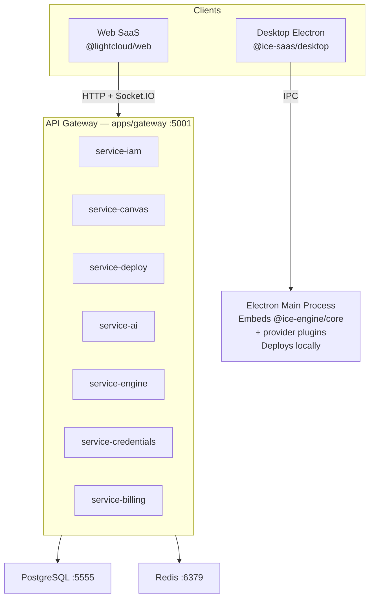
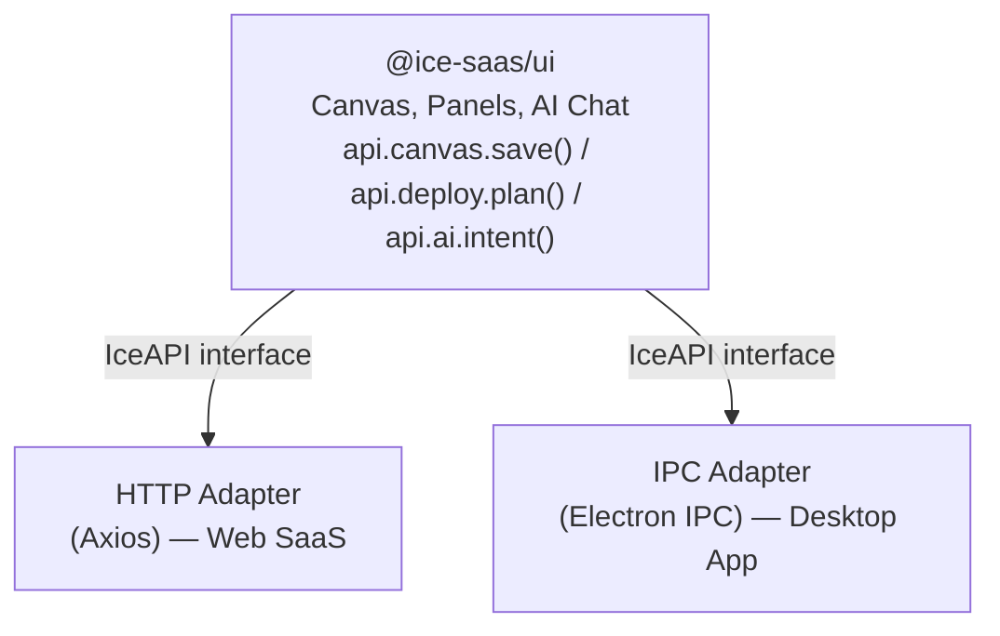
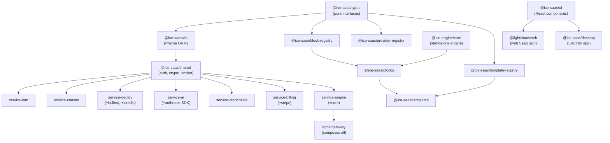

# Architecture Overview

ICE SaaS is structured as a pnpm monorepo with three distinct layers: **shared packages**, **backend services**, and **runnable apps**.

## System Diagram

## API Adapter Pattern

Both web and desktop apps share the same UI components (`@ice-saas/ui`). The key abstraction is the `IceAPI` interface:

- **Web:** `createHttpApiAdapter()` sends HTTP requests to the gateway via Axios
- **Desktop:** `createIpcAdapter()` sends IPC messages to Electron's main process, which runs the engine directly

## Dependency Graph

## Data Flow: Canvas to Deploy

1. User drags blocks onto canvas, connects them
2. Redux `cards` slice updates nodes/edges in memory
3. Auto-save debounces (2s) → saves to localStorage + `POST /api/canvas/:id/card`
4. User clicks "Deploy" → `POST /api/canvas/deploy/plan` with card data
5. Deploy service runs `@ice-engine/core` plan engine → returns diff
6. User confirms → `POST /api/canvas/deploy/apply`
7. Deploy job queued in BullMQ → worker processes
8. Progress streamed via Socket.IO `deploy:{cardId}` room
9. Frontend `DeployPanel` displays real-time progress
10. Deployment record saved to `CanvasDeployment` table

## Data Flow: AI Intent

1. User types intent in `AiChatPanel`
2. Frontend serializes canvas state → `POST /api/ai/intent` (SSE)
3. AI service builds system prompt with schema context (available blocks, connection rules)
4. Claude API called with streaming
5. Response parsed into `AiCanvasOp[]` (addNode, addEdge, deleteNode, etc.)
6. Ops streamed back via SSE as `AiStreamEvent` messages
7. Frontend `operation-executor.ts` dispatches each op to Redux
8. Canvas updates in real-time as ops arrive
9. Conversation + ops saved to `AiConversation` / `AiMessage` tables
10. Audit log written to `AiAuditLog`

## Real-time Communication

Socket.IO manages four room types:

| Room | Pattern | Purpose |
|---|---|---|
| Deploy | `deploy:{cardId}` | Deploy progress events |
| Canvas | `canvas:{projectId}` | Canvas collaboration (future) |
| Pipeline | `pipeline:{nodeId}` | CI/CD logs for specific node |
| Card Pipeline | `card-pipeline:{cardId}` | Lightweight status badges on canvas |

## Multi-tenancy

- **Organisation** is the tenant boundary
- Users belong to orgs via `OrganisationMember` (roles: owner, admin, member, viewer)
- Projects belong to an org
- Provider credentials are scoped per org
- Project-level access adds finer-grained control via `ProjectMember`

## Environments

Each project can have multiple environments (production, staging, development, PR):

- Each `Environment` maps 1:1 to a `CanvasCard` (separate canvas per environment)
- Production environment is protected (cannot be deleted)
- PR environments are ephemeral — auto-created on GitHub `pull_request` webhook events
- Environment promotion copies canvas state between environments
