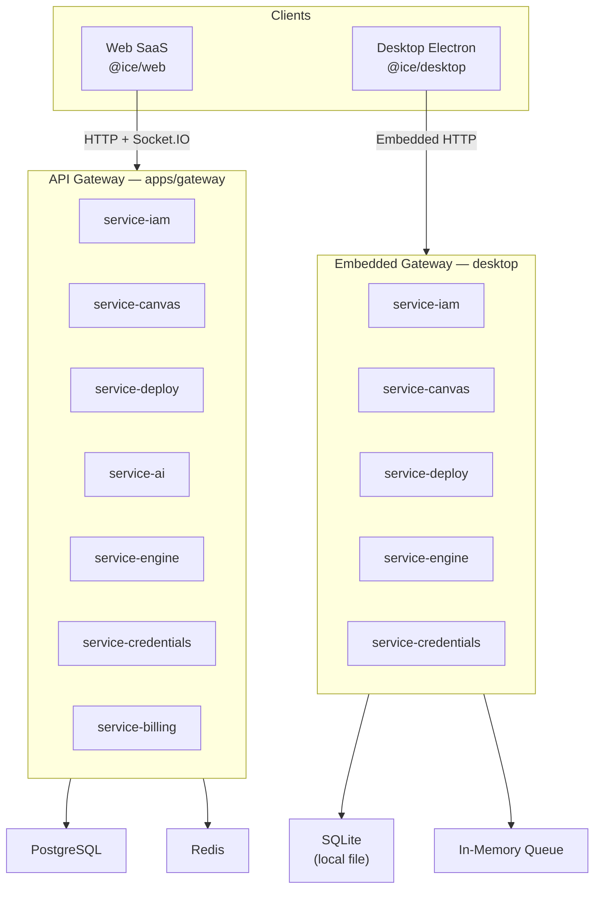
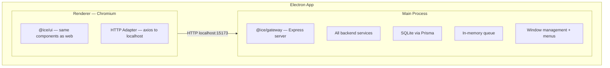
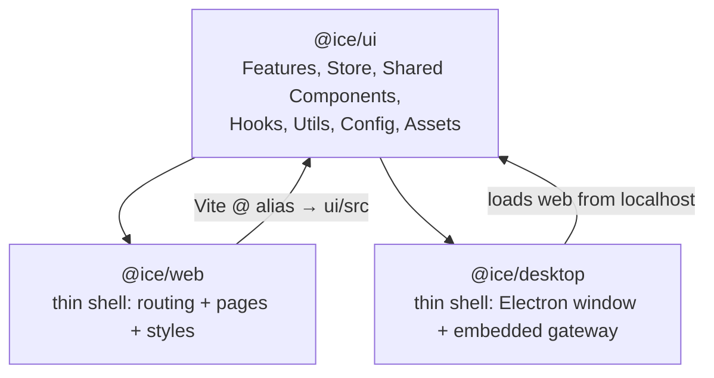
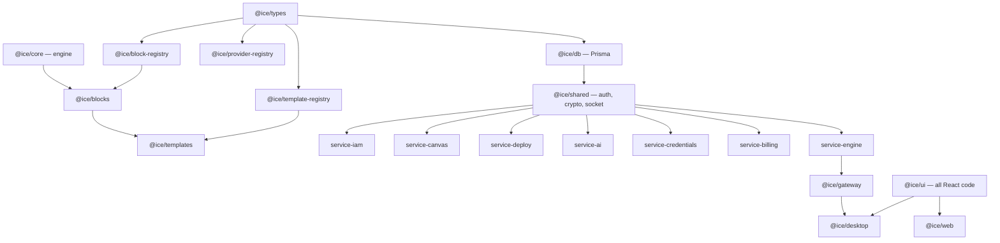
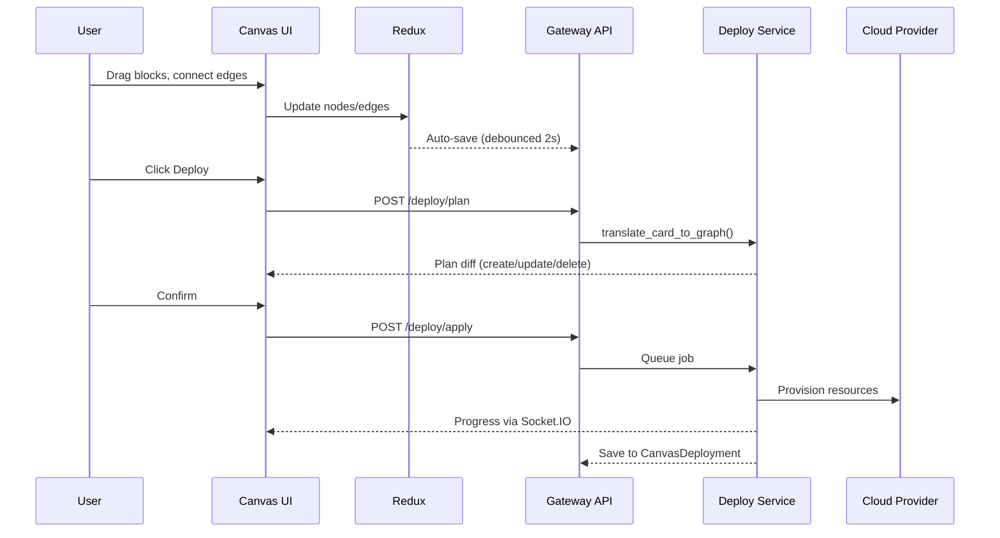
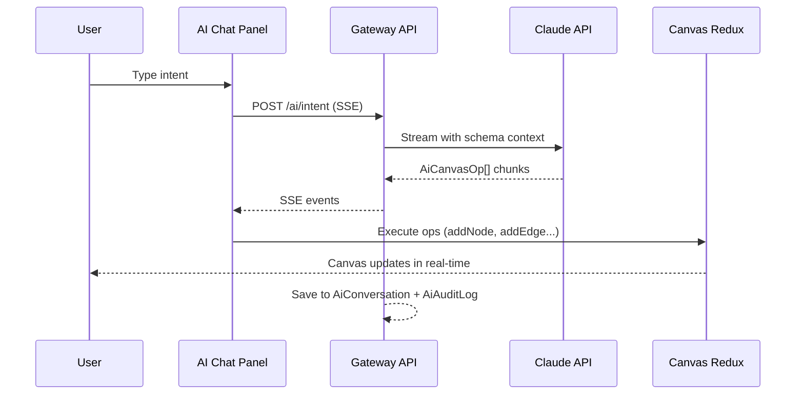
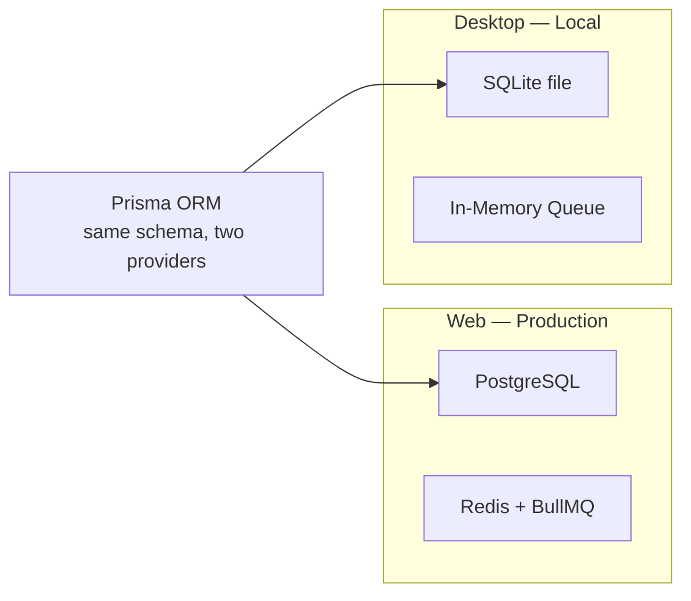

# Architecture Overview

ICE is structured as a pnpm monorepo with three distinct layers: **shared packages**, **backend services**, and **runnable apps**.

## System Diagram

## Desktop = Embedded Web App

The desktop app runs the **exact same code** as the web app — zero duplication:

## Shared UI Architecture

Both apps share `@ice/ui`. The web and desktop apps are thin shells:

## Dependency Graph

## Data Flow: Canvas to Deploy

## Data Flow: AI Intent

## Real-time Communication

Socket.IO manages four room types (authenticated via JWT in handshake):

| Room | Pattern | Purpose |
|---|---|---|
| Deploy | `deploy:{cardId}` | Deploy progress events |
| Canvas | `canvas:{projectId}` | Canvas collaboration (future) |
| Pipeline | `pipeline:{nodeId}` | CI/CD logs for specific node |
| Card Pipeline | `card-pipeline:{cardId}` | Lightweight status badges on canvas |

## Multi-tenancy

- **Organisation** is the tenant boundary
- Users belong to orgs via `OrganisationMember` (roles: owner, admin, member, viewer)
- Projects belong to an org; provider credentials are scoped per org
- Project-level access via `ProjectMember`
- **Desktop mode:** single local user, auth bypassed (`ICE_DESKTOP=true`)

## Environments

Each project can have multiple environments (production, staging, development, PR):

- Each `Environment` maps 1:1 to a `CanvasCard` (separate canvas per environment)
- Production is protected (cannot be deleted)
- PR environments are ephemeral — auto-created on GitHub webhook
- Environment promotion copies canvas state between environments

## Database Strategy

- **Same Prisma schema** — `schema.prisma` (PostgreSQL) and `schema.sqlite.prisma` (SQLite)
- Zero raw SQL — all queries through Prisma, portable across providers
- Desktop data: `~/Library/Application Support/@ice/desktop/ice-desktop.db`
