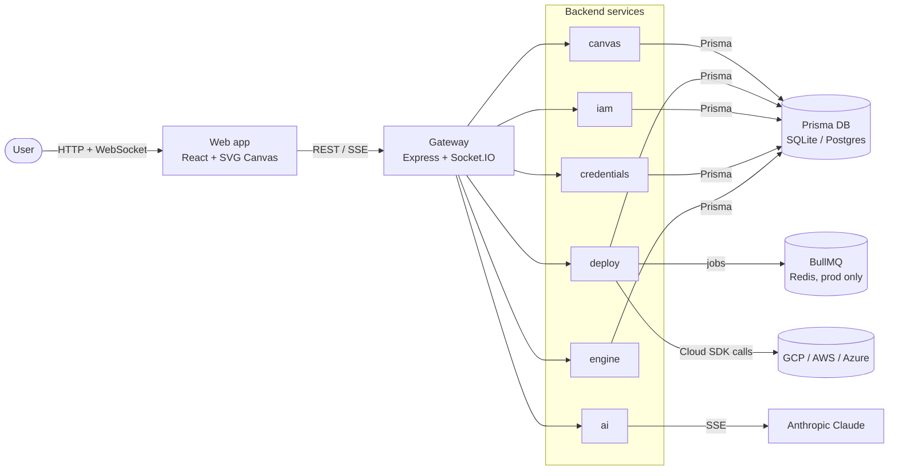
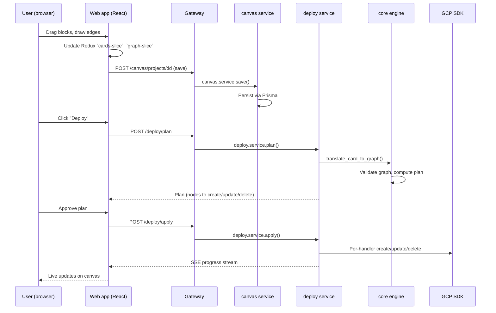

# Architecture

This page describes ICE as a whole: what the major pieces are, how they talk to each other, and where the interesting seams are. Individual subsystems are covered in their own reference pages; links throughout.

## One-minute model



The **web app** is the only UI surface in development mode. The **Electron desktop app** re-uses the same web bundle with an embedded gateway inside the Electron main process - see [desktop.md](desktop.md).

## Monorepo layout

```
ice/
├── apps/
│   ├── gateway/          Express composition of all services; routes, CORS, auth middleware
│   └── desktop/          Electron main process, IPC, window management, auto-update
├── packages/
│   ├── core/             Graph engine, schemas, deploy planner, importers - no UI, no network
│   ├── ui/               Shared React components (canvas, palette, panels, AI chat)
│   ├── web/              Vite shell that boots the UI as a web app
│   ├── blocks/           Cloud resource block definitions (concepts + provider-specific variants)
│   ├── templates/        Pre-built infrastructure compositions (SaaS starter, RAG chatbot, …)
│   ├── providers/aws/    AWS deployer implementation
│   ├── providers/azure/  Azure deployer implementation
│   ├── providers/gcp/    GCP deployer (20 service handlers)
│   ├── db/               Prisma schema + client singleton
│   ├── shared/           Auth middleware, crypto, Socket.IO helpers
│   ├── constants/        Shared constants used across packages
│   ├── ai/               AI provider abstraction (Anthropic + OpenAI-compatible)
│   └── types/            Shared TypeScript interfaces - API contracts, DTOs, events
└── services/
    ├── canvas/           CanvasProject + environments CRUD
    ├── deploy/           Plan, apply, pipelines, GitHub webhooks, queue workers
    ├── ai/               Claude integration, SSE streaming, diagnose-deploy service
    ├── iam/              User/org/auth endpoints, onboarding, profile
    ├── credentials/      Encrypted cloud-provider credential storage
    └── engine/           Schema + resource metadata API
```

Nothing in `packages/` depends on anything in `services/` or `apps/`. Services depend on packages; apps depend on everything.

## Request flow: building and deploying a canvas



The two interesting boundary crossings:

1. **`translate_card_to_graph`** (`packages/core/src/deploy/card-translator.ts`) - converts the UI's "cards" (visual blocks with properties) into the core engine's provider-agnostic graph. This is where the visual representation and the deploy model actually meet.
2. **Per-handler apply** (`packages/providers/gcp/src/handlers/*`, `packages/core/src/deploy/providers/gcp/handlers/*`) - one handler per cloud service (Cloud Run, Cloud SQL, Pub/Sub, Firestore, BigQuery, Vertex AI, …). Each handler knows how to create, update, delete, and diff one resource type.

## Data flow: canvas → graph → cloud

```mermaid
flowchart TD
    canvas[Canvas state<br/>Redux slices]
    cards[Cards + edges<br/>UI-shaped]
    graph[Typed graph<br/>nodes + edges + properties]
    plan[Deploy plan<br/>create/update/delete list]
    apply[Per-handler apply<br/>real cloud SDK calls]
    cloud[(Cloud resources)]

    canvas -->|serialize| cards
    cards -->|translate_card_to_graph| graph
    graph -->|validate + diff vs state| plan
    plan -->|topological apply| apply
    apply --> cloud
    cloud -->|observed state| graph
```

State for the "last-applied" graph is persisted in the DB; the deploy engine diffs the desired graph against the last-applied graph to compute the plan. See [core-engine.md](core-engine.md).

## Realtime

Long-running operations (deploys, imports, AI streams) push live updates over a Socket.IO connection from the gateway. The web app subscribes per-project and renders progress on the canvas as it arrives. The desktop app uses the same transport; the Socket.IO server is hosted inside the embedded gateway.

- Server: `packages/shared/src/socket.ts`, `services/deploy/src/services/deploy-event-log.ts`.
- Client: `packages/ui/src/shared/hooks/use-socket.ts` and slice-specific listeners.

## Authentication model (honest description)

Today ICE Community Edition is **single-user by design**. The gateway auto-seeds a local user on startup and stamps all data with their ID. There is no login screen. This is deliberate - the self-hosted Community Edition is not a multi-tenant system.

For a multi-user setup you would run ICE Cloud (managed) or adapt the gateway's auth middleware (`packages/shared/src/auth`) to your organisation's needs. Multi-user RBAC is tracked on the [roadmap](../ROADMAP.md).

## Storage

| Data | Where |
|---|---|
| Canvas projects, environments, pipelines | Prisma DB (SQLite in dev, Postgres in prod) |
| Cloud credentials | Prisma DB, encrypted at rest with AES-256-GCM |
| Deploy event log | Prisma DB |
| Job queue (prod) | Redis via BullMQ |
| Session | Stateless JWT cookies |
| File uploads | Local filesystem for dev; object storage for prod |

See [database.md](database.md) for the schema walkthrough.

## Deploy engine overview

The deploy engine is provider-agnostic at the top level. Each supported cloud has a deployer (`packages/providers/<cloud>/`) that registers handlers for resource types. The core engine:

1. Receives a desired graph.
2. Loads the last-applied graph from state.
3. Computes a diff (create, update, delete, no-op).
4. Topologically orders the operations.
5. Calls handlers for each operation, in order, streaming progress.
6. Writes the new state back on success; rolls forward to the last good state on partial failure.

GCP coverage is the most complete (20 service handlers, full lifecycle). AWS and Azure are intentionally partial - they exist, they compile, many handlers work, but GCP is the only provider where we claim "production-ready" at this stage. See [core-engine.md](core-engine.md) for the plan/apply implementation and [ROADMAP.md](../ROADMAP.md) for provider coverage plans.

## AI assistant

An optional Anthropic Claude integration can modify the canvas via natural language. The server side (`services/ai`) streams responses over Server-Sent Events; tool use lets the model emit canvas-mutation events that the client applies. Requires `ANTHROPIC_API_KEY` to be set. See [ai-assistant.md](ai-assistant.md).

## Security notes

- All cloud credentials are encrypted at rest (AES-256-GCM) before Prisma writes them; the encryption key lives in `CREDENTIAL_ENCRYPTION_KEY`.
- GitHub webhook payloads are HMAC-verified in `services/deploy/src/routes/webhooks.ts`.
- CORS is restricted to `FRONTEND_URL`.
- Helmet.js sets standard security headers.
- Rate limits sit in front of every API route in `apps/gateway/src/index.ts`.
- The desktop app uses Electron with `nodeIntegration: false`, `contextIsolation: true`, `sandbox: true`. Renderer → main IPC is typed and deliberate.

See [`../SECURITY.md`](../SECURITY.md) for the disclosure process.

## See also

- [core-engine.md](core-engine.md), [frontend.md](frontend.md), [services.md](services.md), [database.md](database.md), [desktop.md](desktop.md).
- [deploying-to-gcp.md](deploying-to-gcp.md) - the end-to-end flow as a tutorial.
- [`packages/core/src/`](../packages/core/src/) - the canonical implementation of everything on this page.
