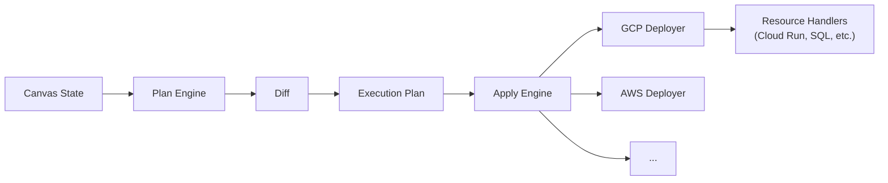

# Core Engine (`@ice/core`)

The core engine is the computational heart of ICE. It handles graph processing, infrastructure diffing, deploy orchestration, and multi-cloud resource importing.

**Location:** `packages/core/`

## Module Structure

```
packages/core/src/
├── graph/           Graph data structures + processing
│   ├── mutable-graph.ts        Core graph implementation
│   ├── algorithms.ts           Graph algorithms (traversal, ordering)
│   ├── parser/                 Graph DSL parser
│   │   ├── lexer.ts
│   │   ├── ast.ts
│   │   ├── tokens.ts
│   │   ├── parser.ts
│   │   └── format-parser.ts
│   ├── validator/              Graph validation rules
│   └── classifier/             Node categorization
│       └── inference/          Relationship inference engine
│
├── plan/            Infrastructure planning
│   ├── plan-engine.ts          Computes desired → actual diff
│   └── diff.ts                 Structural diff algorithm
│
├── apply/           Plan execution
│   ├── apply-engine.ts         Executes planned changes
│   └── types.ts
│
├── deploy/          Cloud deployment
│   ├── deploy-engine.ts        Orchestrates multi-resource deploys
│   ├── state-bridge.ts         Maps canvas state to deploy state
│   ├── state-store-adapter.ts  Persistent deploy state
│   ├── environment-config.ts   Environment-specific config
│   ├── messages.ts             Deploy message types
│   └── gcp/                    GCP deployer
│       ├── gcp-deployer.ts     Main GCP deploy orchestrator
│       ├── auth.ts             Google auth helpers
│       ├── sdk-loader.ts       Dynamic SDK loading
│       └── handlers/           15+ resource handlers
│           ├── cloud-run.ts
│           ├── cloud-functions.ts
│           ├── cloud-storage.ts
│           ├── cloud-sql.ts
│           ├── firestore.ts
│           ├── pubsub.ts
│           ├── bigquery.ts
│           ├── gke.ts
│           ├── memorystore.ts
│           ├── secret-manager.ts
│           ├── cloud-scheduler.ts
│           ├── api-gateway.ts
│           ├── vertex-ai.ts
│           ├── dataflow.ts
│           └── ...
│
├── importers/       Import existing infrastructure
│   ├── gcp/         GCP importer (compute, storage, asset-inventory)
│   ├── aws/         AWS importer
│   ├── azure/       Azure importer
│   ├── terraform/   Terraform state importer
│   └── pulumi/      Pulumi state importer
│
├── providers/       Provider abstraction
│   ├── provider-registry.ts
│   └── mock-provider.ts
│
├── resources/       Resource definitions
│   ├── cloud-blocks.ts
│   ├── cloud-providers.ts
│   ├── blueprint-factory.ts
│   └── high-level-resources.ts
│
├── schemas/         Schema registry
│   ├── db/          SQLite-backed schema DB
│   └── embedded/    Embedded schema registry
│
├── diff/            Diff engine
│
└── cli/             ICE CLI (`ice` binary)
```

## Graph Engine

The `MutableGraph` is the core data structure representing infrastructure as a directed graph:

- **Nodes** = cloud resources (compute instances, databases, storage, etc.)
- **Edges** = connections/dependencies between resources
- **Algorithms** support topological sort, cycle detection, dependency resolution
- **Validator** enforces connection rules (e.g., which resource types can connect)
- **Classifier** categorizes nodes and infers relationships

## Plan / Apply Lifecycle



1. **Plan:** Compares desired state (canvas) against actual state (cloud) → produces a diff
2. **Diff:** Identifies resources to create, update, or delete
3. **Apply:** Executes the plan by calling cloud provider APIs through resource handlers

## GCP Deployer

The most mature deployer, handling 15+ GCP resource types:

| Handler | GCP Service |
|---|---|
| `cloud-run.ts` | Cloud Run services |
| `cloud-functions.ts` | Cloud Functions (2nd gen) |
| `cloud-storage.ts` | Cloud Storage buckets |
| `cloud-sql.ts` | Cloud SQL instances |
| `firestore.ts` | Firestore databases |
| `pubsub.ts` | Pub/Sub topics + subscriptions |
| `bigquery.ts` | BigQuery datasets + tables |
| `gke.ts` | GKE clusters |
| `memorystore.ts` | Memorystore (Redis) |
| `secret-manager.ts` | Secret Manager secrets |
| `cloud-scheduler.ts` | Cloud Scheduler jobs |
| `api-gateway.ts` | API Gateway configs |
| `vertex-ai.ts` | Vertex AI endpoints |
| `dataflow.ts` | Dataflow jobs |
| `identity-platform.ts` | Identity Platform |

## Importers

Import existing infrastructure into the canvas:

- **GCP Importer:** Uses Asset Inventory API to scan compute, storage, and other resources
- **AWS Importer:** Scans AWS resources via SDK
- **Azure Importer:** Scans Azure resources
- **Terraform Importer:** Parses `.tfstate` files
- **Pulumi Importer:** Parses Pulumi state

Each importer has a **type-mapper** that converts cloud-specific resource types into ICE canvas node types.

## Sub-path Exports

```typescript
import { MutableGraph } from '@ice/core/graph'
import { MockProvider } from '@ice/core/providers'
import { GraphNode, GraphEdge } from '@ice/core/types'
import { CloudBlocks } from '@ice/core/resources'
import { SchemaRegistry } from '@ice/core/schemas'
```

## Key Dependencies

- `@google-cloud/*` SDKs (Cloud Run, Storage, SQL, Pub/Sub, etc.)
- `google-auth-library` for GCP authentication
- `better-sqlite3` for embedded schema database
- `@viz-js/viz` for graph visualization
- `commander` + `chalk` + `ora` for CLI
