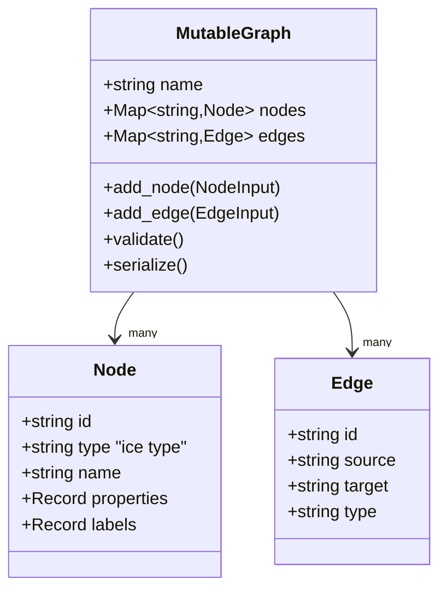

# Core Engine

The core engine (`packages/core/`) is the provider-agnostic brain: everything about *how* infrastructure is modelled, validated, diffed, planned, applied, and imported, with no UI and no network dependencies. Everything else in ICE is either a consumer of core or a translator into it.

## Concepts in one page

- **Graph** — a typed set of nodes (resources) and edges (relationships). This is ICE's internal representation; every cloud shape maps to a graph.
- **Schema** — what properties a given ICE resource type can have, which are required, what types they accept. Stored as a SQLite database generated from Terraform and Pulumi provider schemas (tens of thousands of resource types).
- **ICE type** — a provider-neutral resource identifier like `compute.run.service` or `storage.bucket`. Each ICE type has one or more provider implementations (GCP Cloud Run, AWS Lambda, etc.).
- **Plan** — a list of create/update/delete operations computed by diffing a desired graph against last-applied state.
- **Apply** — execute the plan, streaming progress, writing the new state.
- **Handler** — provider-specific code that knows how to create, update, delete, and diff one resource type.

## What's in the package

```
packages/core/src/
├── index.ts                  Top-level re-export surface
├── types/                    Shared types: Result, errors, IDs
├── schema/                   SchemaProvider interface + SQLite implementation
├── schemas/                  SQLite DBs (base + per-provider) and the loader
├── graph/                    Parser, MutableGraph, algorithms, validator, classifier, inference
├── state/                    Deploy state persistence (last-applied graph)
├── plan/                     Plan computation — desired vs current, topological order
├── apply/                    Execute a plan
├── diff/                     Property-level diff helpers
├── compute/                  Derived / aggregate / propagation rules for blocks
├── deploy/                   Deploy engine: card translator, deploy service, provider index
├── providers/                Provider registry + mock provider for tests
├── resources/                High-level resources, blueprint factory, cloud provider registry
├── importers/                Terraform, Pulumi, GCP, AWS, Azure importers
├── validation/               Canvas-level validation (separate from graph validation)
├── export/                   Terraform / Pulumi export from a graph
├── errors/                   Domain-specific error types
└── cli/                      The `ice` CLI binary
```

Nothing here imports from `services/`, `apps/`, or the UI packages. The engine is usable standalone — you could import it in a script and run a deploy programmatically. The CLI (`ice` in `packages/core/src/cli/`) does exactly this.

## Graph model

A graph is nodes + edges with provider-neutral types and property bags.



Key file: `packages/core/src/graph/mutable-graph.ts`. Algorithms (topological sort, cycle detection, path finding, execution layers) live in `packages/core/src/graph/algorithms.ts`.

## From a canvas to a deploy

```mermaid
flowchart LR
    ui[UI cards + edges]
    graph[Graph]
    state[(Last-applied state)]
    plan[Plan]
    apply[Apply]
    cloud[(Cloud)]
    newstate[(New state)]

    ui -->|card-translator| graph
    graph --> plan
    state --> plan
    plan -->|topological order| apply
    apply -->|handler calls| cloud
    apply --> newstate
    newstate -.->|persist| state
```

**`translate_card_to_graph`** (`packages/core/src/deploy/card-translator.ts`) is the only place that knows about UI shapes. It converts cards (drag-drop-able visual blocks) into graph nodes, materializing their provider implementation based on the card's selected provider.

**Plan** (`packages/core/src/plan/`) diffs the desired graph against the current state; each diff entry is `{ op: 'create' | 'update' | 'delete' | 'noop', node_id, changed_properties }`.

**Apply** (`packages/core/src/deploy/deploy-engine.ts` driving `packages/core/src/deploy/scheduler.ts`) is a bounded worker-pool scheduler over the per-node DAG. Pool size defaults to 6; per-handler caps reserve `gcp.sql.* = 1` and `gcp.redis.* = 1` so multi-instance fan-outs don't trip GCP's create-rate quotas. Failure isolates to descendants only — siblings and unrelated branches keep running, which means a 12-resource card that loses one Cloud SQL instance still surfaces the partial-success rollup of the rest. Each node moves through `queued → applying → (succeeded | failed | skipped | cancelled-due-to-dep)`, and the engine streams those transitions to the caller via `on_node_status` plus mid-apply milestones via `on_node_progress`.

Handlers report sub-step progress via `GCPHandlerContext.on_step(name, { label, index, total })` — a Cloud SQL instance create surfaces "Creating instance" → "Waiting for instance to become ready" rather than going dark for ten minutes. The build-helper extension lets cloud-run pin every Cloud Build sub-state (Submitting / queued / running) to its outer step index, so the bar holds steady while labels refresh.

The legacy `apply-engine.ts` and the per-resource percentage that reset between nodes are gone — see decisions entry "2026-04-28 — Parallel deploy scheduler with per-node live status" for the alternatives considered (layer-batched `Promise.all` rejected because it waits for the slowest node in each layer; new socket room rejected because the existing `deploy:<cardId>` is what the canvas hydration is shaped around).

## Live event wire contract

The deploy service publishes one Socket.IO event name (`DEPLOY_EVENT_CHANNEL = 'deploy:event'`) carrying a discriminated `DeployEvent` union — types in `packages/types/src/deploy-events.ts`, emitter helpers in `packages/shared/src/socket/service.ts`. Five variants:

| `event.type` | Fired when |
|---|---|
| `node_status` | Per-node lifecycle transition (`queued` / `applying` / `succeeded` / `failed` / `skipped` / `cancelled-due-to-dep`). Carries `card_id`, `node_id` (canvas id), `resource_name`, `resource_type`, `action: 'create' \| 'update' \| 'delete'`, optional `error: { code, message, recoverable? }`, optional `duration_ms` on terminal states. |
| `node_progress` | Mid-apply milestone from a handler's `ctx.on_step`. Carries `step: { label, index, total }`. |
| `log` | Free-text deploy log line, optionally `node_id`-scoped. |
| `complete` | One-shot terminal for the whole deploy. Carries `outcome: 'success' \| 'partial' \| 'failure' \| 'cancelled'` and `totals: { queued, applying, succeeded, failed, skipped, cancelled }`. The frontend computes its rollup from `nodesById` rather than relying on `totals` for live progress; `totals` is just the post-deploy summary. |
| `requirement_verified` | Post-deploy poller fires when a `BlockRequirementStatus` row flips. Carries the full unique key `(card_id, node_id, environment, requirement)` plus an optional `details` blob. |

Three identifier spaces travel through the deploy stack and are NOT interchangeable:
- **Canvas node id** — user-facing block id from `cards-slice.nodes[i].id`. The wire's `node_id` is always this.
- **Graph node id** — engine-internal `${type}:${name}`, e.g. `gcp.sql.databaseInstance:ice-foo-prod-instance-abc123`. Lives only inside the scheduler and `MutableGraph`.
- **Resource name** — sanitized hash-suffixed cloud resource name (e.g. `ice-foo-prod-instance-abc123`). Carried in `resource_name` for log readability.

The service layer translates graph node id → canvas node id via `translation.deployables[]` before emitting on the wire (`services/deploy/src/services/deploy.service.ts`'s `graphIdToCanvasId` map). Frontend reducers key everything by canvas node id.

## Schemas

Resource schemas live in `packages/core/src/schemas/` as SQLite DBs — one "base" DB bundled with the package and per-provider extension DBs. They're generated from Terraform and Pulumi provider schemas (a one-off build step, committed).

The schema provider (`EmbeddedSchemaProvider` in `packages/core/src/schema/embedded-schema-provider.ts`) queries these DBs at runtime to answer "what properties does `compute.run.service` have on GCP?" and drives validation, autocomplete, and the properties panel.

## Importers

Each importer converts an external representation into an ICE graph:

| Importer | Source | Status |
|---|---|---|
| `importers/terraform/` | Terraform state JSON | Works |
| `importers/pulumi/` | Pulumi checkpoint JSON | Works |
| `importers/gcp/` | Live GCP via Cloud Asset Inventory + service-specific APIs | Works, maps 45+ resource kinds |
| `importers/aws/` | AWS | Partial |
| `importers/azure/` | Azure | Partial |

GCP import has dedicated service modules (`importers/gcp/services/compute.ts`, `storage.ts`, `asset-inventory.ts`) that the top-level importer dispatches to.

## Validation

Two independent layers:

1. **Graph validation** (`graph/validator/`) — cycle detection, reference resolution, type compatibility, connectivity rules. Producer-agnostic; every graph must pass these.
2. **Canvas validation** (`validation/`) — higher-level UX rules: *"a static-site block with a custom-domain edge must have a github-repo configured"*. Runs on UI interactions and before plan.

Both emit `{ severity, code, message, node_id }` issues that the UI renders inline.

## Deploy state

The last-applied graph is persisted in the Prisma DB. `state/` contains the interface; the adapter (`packages/core/src/deploy/state-store-adapter.ts`) bridges to the concrete Prisma-backed SQLite/Postgres store used by the deploy service.

A clean clone of ICE with no deploys has an empty state store; every node in the first plan is a `create`.

## Computing flows

Some block properties are derived from others (`derived`), aggregated across connected nodes (`aggregate`), or propagated along edges (`propagation`). Rules live in `packages/core/src/compute/propagation-rules.ts` and similar. The UI applies these live so that, e.g., a Static Site's "CDN" toggle automatically suggests a Custom Domain requirement.

## Entry points worth reading

- [`packages/core/src/index.ts`](../packages/core/src/index.ts) — the export surface.
- [`packages/core/src/deploy/card-translator.ts`](../packages/core/src/deploy/card-translator.ts) — UI → graph.
- [`packages/core/src/deploy/deploy-engine.ts`](../packages/core/src/deploy/deploy-engine.ts) — apply driver.
- [`packages/core/src/deploy/scheduler.ts`](../packages/core/src/deploy/scheduler.ts) — bounded worker-pool DAG scheduler with per-handler caps.
- [`packages/types/src/deploy-events.ts`](../packages/types/src/deploy-events.ts) — wire-event discriminated union (locked contract).
- [`packages/core/src/graph/mutable-graph.ts`](../packages/core/src/graph/mutable-graph.ts) — the data structure.
- [`packages/core/src/graph/algorithms.ts`](../packages/core/src/graph/algorithms.ts) — topological sort, cycles, paths.

## See also

- [architecture.md](architecture.md) for the bird's-eye view.
- [services.md](services.md) — how the `deploy` service uses this package.
- [blocks-reference.md](blocks-reference.md) — where the UI cards that feed the translator come from.
