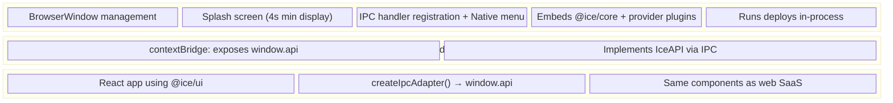

# Desktop App (`@ice/desktop`)

The ICE desktop app is an Electron application that shares the same UI components as the web SaaS but runs deploys locally — no backend server required.

**Location:** `apps/desktop/`
**Tech:** Electron 28, electron-vite, React 18

## Architecture

Standard 3-process Electron model:



## IPC Bridge

The key to sharing UI between web and desktop is the `IceAPI` interface:

```typescript
// Web: HTTP adapter
setApiAdapter(createHttpApiAdapter())  // Axios → gateway

// Desktop: IPC adapter
setApiAdapter(createIpcAdapter())      // Electron IPC → main process
```

Both adapters implement the same interface, so UI components call `api.canvas.save()`, `api.deploy.plan()`, etc. without knowing the transport.

## Main Process Modules

| Module | Purpose |
|---|---|
| `index.ts` | Window management, splash screen, app lifecycle |
| `ipc-handlers.ts` | Canvas, profile, auth IPC handlers |
| `deploy-handler.ts` | Deploy-specific IPC, calls `@ice/core` directly |
| `github-service.ts` | GitHub integration (native, no backend) |
| `menu.ts` | Native application menu |
| `messages.ts` | IPC message type constants |

## Local Deploys

The desktop app directly embeds:
- `@ice/core` — for plan/apply
- `@ice/provider-gcp` — GCP deployer
- `@ice/provider-registry` — provider abstraction

Deployments run entirely in-process without needing the gateway server. The user's local cloud credentials (e.g., `gcloud auth`) are used directly.

## Build & Distribution

Uses `electron-builder` for packaging:
- **macOS:** DMG
- **Windows:** NSIS installer
- **Linux:** AppImage

Build tool: `electron-vite` (Vite-based Electron build pipeline)

## Dependencies

- `@ice/core`, `@ice/blocks`, `@ice/types`, `@ice/ui`
- `@ice/provider-gcp`, `@ice/provider-registry`
- `electron`, `@electron-toolkit/utils`
