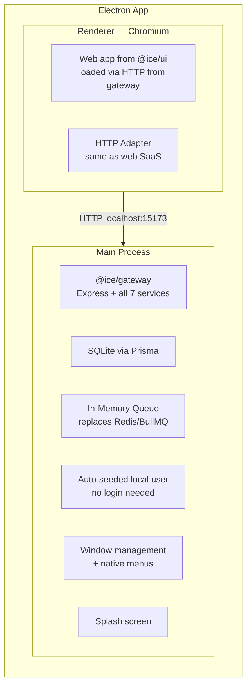
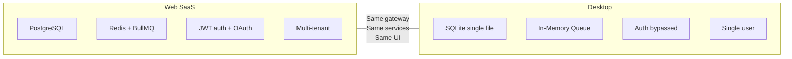

# Desktop App (`@ice/desktop`)

The ICE desktop app is an Electron application that embeds the **entire web app + backend** — same code, zero duplication. It works standalone without any external server, database, or Redis.

**Location:** `apps/desktop/`
**Tech:** Electron 28, electron-vite, React 18, SQLite, Express

## Architecture



## How It Works

1. **Main process** sets env vars (`ICE_DESKTOP=true`, `DATABASE_URL=file:...`, etc.)
2. **Embedded gateway** starts on port 15173 — same Express server as production
3. **SQLite** replaces PostgreSQL — same Prisma schema, just different provider
4. **In-memory queue** replaces Redis/BullMQ — deploy jobs processed locally
5. **Auth bypassed** — local user auto-created on first run, no login screen
6. **Renderer** loads `http://localhost:15173` (or Vite dev server in dev mode)
7. **Same UI** — all components from `@ice/ui`, no desktop-specific UI code

## Key Differences from Web



| Feature | Web | Desktop |
|---|---|---|
| Database | PostgreSQL | SQLite |
| Queue | Redis + BullMQ | In-memory |
| Auth | JWT + OAuth | Bypassed (local user) |
| Users | Multi-tenant | Single user |
| Deploy | Via backend | Same backend, embedded |
| GitHub | OAuth flow | Same (via HTTP) |
| GCP/AWS/Azure | Same | Same |

## Platform Window Behavior

### macOS
- `hiddenInset` title bar — traffic lights overlaid on the app bar
- Traffic light position: `{x: 12, y: 14}` (centered in 44px header)
- 78px left padding on AppBar, reactively removed on fullscreen/maximize
- Header is draggable (`-webkit-app-region: drag`)

### Windows
- Standard system title bar with close/minimize/maximize
- Menu bar auto-hidden (accessible via Alt)

### Linux
- Standard title bar, system-native controls

## Development

```bash
# Start desktop dev (gateway + web Vite + Electron)
pnpm dev:desktop

# This runs concurrently:
# 1. Gateway on port 15173 (with ICE_DESKTOP=true)
# 2. Web Vite dev server on port 5173
# 3. Electron loading from localhost:5173
```

## Build & Distribution

```bash
pnpm dist:desktop          # Current platform
pnpm dist:desktop:mac      # macOS DMG (universal)
pnpm dist:desktop:win      # Windows NSIS installer
pnpm dist:desktop:linux    # Linux AppImage
```

## Data Storage

| Data | Location | Format |
|---|---|---|
| Database | `~/Library/Application Support/@ice/desktop/ice-desktop.db` | SQLite |
| Projects, cards, deployments | In SQLite via Prisma | Relational |
| Cloud credentials | In SQLite (encrypted) | AES-256-GCM |
