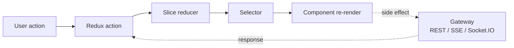

# Frontend

ICE's frontend is a React 18 single-page app hosted by Vite (in dev) or served statically from the gateway (in production). The Electron desktop app wraps the same bundle. There are no framework-level surprises — the interesting parts are the custom SVG canvas and the Redux state shape.

## Packages involved

| Package | Responsibility |
|---|---|
| `packages/ui` | Shared React components. Canvas, palette, properties, AI chat, context menus, toolbars. Imported by `web` and `desktop`. |
| `packages/web` | Vite shell. Routing, entry point (`main.tsx`), top-level pages (template gallery, settings, project view). |
| `packages/ui/src/store/` | Redux store: 17 slices covering cards, graph, selection, environments, AI, ghost-mode, etc. |

## Canvas

The canvas is a custom SVG renderer, not React-Flow or a third-party library. The decision was deliberate: panning/zooming a 1000-node graph at 60fps required more control than the off-the-shelf options gave.

```
packages/ui/src/features/canvas/
├── components/
│   ├── svg-canvas.tsx             Top-level SVG host
│   ├── nodes/                     Per-block-type node components
│   ├── context/                   Right-click menus (canvas, node, edge)
│   ├── ghost/                     "Ghost" mode: AI-suggested additions before they're real
│   └── …
├── hooks/                         use-computing-flows, selection, drag, zoom
└── utils/                         Ghost suggestions, auto-layout, etc.
```

Nodes are drawn as SVG groups; edges are SVG paths. Zoom + pan use native SVG viewBox math, not CSS transforms — predictable semantics at any zoom.

## Redux state

Seventeen slices under `packages/ui/src/store/slices/`:

| Slice | What lives here |
|---|---|
| `account-slice` | Current user, org |
| `ai-slice` | Chat history, streaming state |
| `cards-slice` | The UI-shaped block model — what the canvas renders |
| `debug-slice` | Feature flags, dev-only toggles |
| `deploy-slice` | Deploy progress (per-node `nodesById` keyed by canvas node id, populated from the typed `deploy:event` socket channel), last plan, environment status |
| `environments-slice` | Production / staging / preview selection |
| `ghost-slice` | AI's proposed additions before commit |
| `graph-slice` | Derived, provider-neutral graph (sync with cards) |
| `integrations-slice` | GitHub, Anthropic, cloud provider status |
| `onboarding-slice` | First-run wizard state |
| `pipeline-slice` | CI/CD wiring per project |
| `project-list-slice` | The projects list in the project browser |
| `projects-slice` | Current project detail |
| `selection-slice` | Which blocks/edges are selected |
| `ui-slice` | Modals, panels, sidebar collapsed/expanded |
| `validation-slice` | Live validation issues |
| `view-slice` | Zoom level, pan offset, LOD (level of detail) |

Slice boundaries are drawn to match feature boundaries: a feature folder under `packages/ui/src/features/` usually owns one or two slices. The split between `cards-slice` (UI-shaped) and `graph-slice` (provider-neutral) reflects the translator boundary described in [core-engine.md](core-engine.md).

## Feature folders

Each folder under `packages/ui/src/features/` encapsulates one user-facing feature:

```
packages/ui/src/features/
├── account            User menu, org switcher, settings
├── ai                 Claude chat panel, SSE stream client
├── canvas             The canvas itself
├── concept-info       Hover-over explanations for concepts
├── cost               Per-block and per-canvas cost estimation
├── debug              Dev-only inspector panel
├── deploy             Deploy button, progress panel
├── environments       Env tabs and switching
├── integrations       GitHub + cloud provider credential UI
├── onboarding         First-run wizard
├── palette            Left sidebar: drag source for blocks
├── pipeline           CI/CD config UI
├── project-browser    Projects list
├── properties         Right sidebar: block property editor
├── templates          Template gallery + detail
├── toolbar            Top toolbar
├── validation         Inline validation badges
└── wizard             Add-anything wizard
```

Each folder is self-contained: components, hooks, and the occasional sub-slice all colocated. Imports across folders go through clear public entry points (barrel exports).

## Styling

- **Tailwind CSS** for layout and one-off styling.
- **Radix UI** for primitives that need accessibility care (popover, dropdown, dialog).
- **Custom design tokens** named `ice-*` (e.g. `text-ice-text-2`, `bg-ice-raised`). Defined in the Tailwind config.

There is no component library abstraction over Tailwind; components compose raw Tailwind classes. That's a deliberate simplicity choice — the design system lives in tokens and conventions, not in a wrapper library.

## Data flow in the UI



Async work lives in thunks (`createAsyncThunk`) colocated with the slice that owns the state they mutate. Side effects are explicit at the thunk boundary; reducers are pure.

Real-time updates (deploy progress, AI stream, graph events) arrive via Socket.IO and are dispatched into the relevant slice. See `packages/ui/src/shared/hooks/use-socket.ts`.

## Internationalisation

`packages/ui/src/i18n/` — hand-rolled, not a framework. Two locales: English and Mandarin, both complete for the current UI surface. Adding a locale means adding a new JSON file and listing it in `i18n/index.ts`.

Usage: `const { t } = useTranslation(); t('templates.gallery.title')`.

## Entry points worth reading

- [`packages/ui/src/features/canvas/components/svg-canvas.tsx`](../packages/ui/src/features/canvas/components/svg-canvas.tsx) — the canvas container.
- [`packages/ui/src/store/slices/cards-slice.ts`](../packages/ui/src/store/slices/cards-slice.ts) — the UI model.
- [`packages/ui/src/features/palette/`](../packages/ui/src/features/palette/) — left sidebar drag source.
- [`packages/ui/src/features/properties/`](../packages/ui/src/features/properties/) — right sidebar editor.
- [`packages/web/src/app/app.tsx`](../packages/web/src/app/app.tsx) — routing + top-level layout.

## See also

- [core-engine.md](core-engine.md) — where the `graph-slice` data ultimately goes.
- [ai-assistant.md](ai-assistant.md) — the AI chat panel.
- [desktop.md](desktop.md) — how this bundle runs inside Electron.
