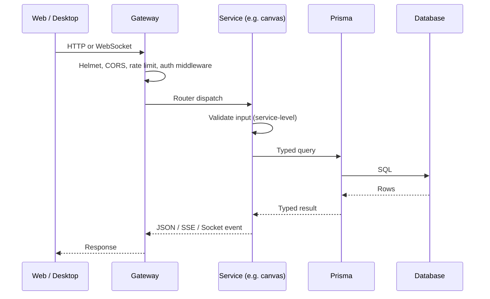
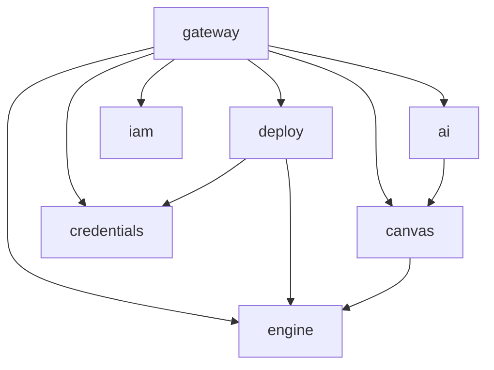

# Backend Services

Six Express-based services live under `services/`. Each is a thin router plus a few service classes; all state goes through Prisma. A single gateway (`apps/gateway/`) composes all six into one HTTP+WebSocket surface.

In Community Edition, the gateway and all six services run in one process (no inter-service HTTP - it's all in-process function calls). The separation is a code-organization choice, not a deployment choice.

## The six services

| Service | Purpose | Key files |
|---|---|---|
| **canvas** | CanvasProject CRUD, environments, project members | `services/canvas/src/services/environment.service.ts` |
| **deploy** | Plan, apply, pipelines, GitHub webhooks, queue workers, drift detection | `services/deploy/src/services/deploy.service.ts`, `pipeline.service.ts`, `queue.service.ts`, `webhooks.ts` |
| **ai** | Anthropic Claude integration, SSE streaming, deploy-failure diagnosis | `services/ai/src/services/ai.service.ts`, `diagnose-deploy.service.ts` |
| **iam** | Users, orgs, profile, onboarding flow | `services/iam/src/` |
| **credentials** | Encrypted provider + GitHub credential storage | `services/credentials/src/routes/providers.ts` |
| **engine** | Schema + resource metadata API (what blocks exist, what properties they have) | `services/engine/src/` |

All six expose Express `Router()` objects consumed by the gateway:

```ts
// apps/gateway/src/index.ts (abbreviated)
app.use('/api/canvas', createCanvasRouter());
app.use('/api/deploy', createDeployRouter());
app.use('/api/ai', createAiRouter());
app.use('/api/iam', createIamRouter());
app.use('/api/credentials', createCredentialsRouter());
app.use('/api/engine', createEngineRouter());
```

The gateway adds CORS, Helmet, cookie-parser, rate limiting, and Socket.IO; the individual services are HTTP-transport agnostic below the router factory.

## Request flow



For long-running work (deploy apply, imports), the service emits Socket.IO events instead of returning a single response. The gateway hosts the Socket.IO server.

## Auth middleware

`packages/shared/src/auth/` provides `requireUser`, `requireProjectAccess`, and friends. The middleware is shared across all services. Community Edition auto-seeds a single "desktop user" on gateway startup so every authenticated route resolves to the same user - see `setDesktopUser()` in `packages/shared` and how `apps/gateway/src/index.ts` calls it.

For ICE Cloud, the same middleware works against real JWTs.

## The deploy service in detail

The deploy service is by far the most complex - it's where ICE actually talks to the real world. Notable components:

- `deploy.service.ts` - orchestrates plan + apply.
- `pipeline.service.ts` - CI/CD wiring: GitHub repo → canvas → deploy.
- `queue.service.ts` - BullMQ worker setup (prod only; Community Edition runs synchronously).
- `requirement-poller.service.ts` - polls GCP APIs while we wait for a slow resource (Cloud SQL, SSL cert).
- `drift-detection.test.ts` / `drift` logic - detect when cloud state has drifted from what ICE last applied.
- `routes/webhooks.ts` - HMAC-verified GitHub webhook receiver.
- `routes/canvas-deploy.ts` - the deploy REST endpoints.

Queue mode: when `REDIS_URL` is set, long-running work is enqueued with BullMQ and picked up by workers. When `REDIS_URL` is empty (the default in dev and in the desktop app), deploy runs synchronously in-process. Both code paths exist in `queue.service.ts`.

## The credentials service in detail

Stores per-user cloud-provider credentials and GitHub tokens, encrypted at rest.

- **Encryption:** AES-256-GCM via `packages/shared/src/crypto.ts`. Key comes from `CREDENTIAL_ENCRYPTION_KEY` (must be exactly 32 characters).
- **Storage:** Prisma `ProviderCredential` / `GitHubInstallation` tables.
- **Validation:** each provider has a `validate` endpoint that does a read-only API call to check the credential still works.
- **Lifecycle:** credentials can be rotated; rotation re-encrypts and updates a `version` field.

See `services/credentials/src/routes/providers.ts` and `packages/shared/src/__tests__/crypto.test.ts`.

## The AI service in detail

Thin wrapper over Anthropic Claude. Two endpoints:

- **Chat** - SSE stream. Takes the current canvas as context, streams back text + tool-use events. The client (`packages/ui/src/features/ai/`) applies tool-use events as canvas mutations.
- **Diagnose deploy** - takes a deploy error payload, returns a human-readable explanation + suggested fix.

Backed by `packages/ai/`, which abstracts over Anthropic's API. An OpenAI-compatible backend is supported (route through a local Ollama or similar).

## Service-to-service dependencies



Edges represent in-process function calls, not HTTP. The deploy service, for example, reads cloud credentials from the credentials service by directly calling its service functions - no REST hop between them.

## Running one service standalone

In theory each service's `createXRouter()` can be mounted in a custom Express app. In practice, Community Edition always runs them behind the gateway. A standalone per-service process is a Cloud-tier deployment pattern.

## Entry points worth reading

- [`apps/gateway/src/index.ts`](../apps/gateway/src/index.ts) - the composition.
- [`services/deploy/src/services/deploy.service.ts`](../services/deploy/src/services/deploy.service.ts) - plan + apply orchestration.
- [`services/deploy/src/routes/canvas-deploy.ts`](../services/deploy/src/routes/canvas-deploy.ts) - deploy REST endpoints.
- [`services/ai/src/routes/ai.ts`](../services/ai/src/routes/ai.ts) - the SSE endpoint.
- [`packages/shared/src/auth/`](../packages/shared/src/auth) - middleware.

## See also

- [architecture.md](architecture.md) - how the services fit in the whole.
- [database.md](database.md) - the Prisma schema they share.
- [ai-assistant.md](ai-assistant.md) - AI service deep dive.
